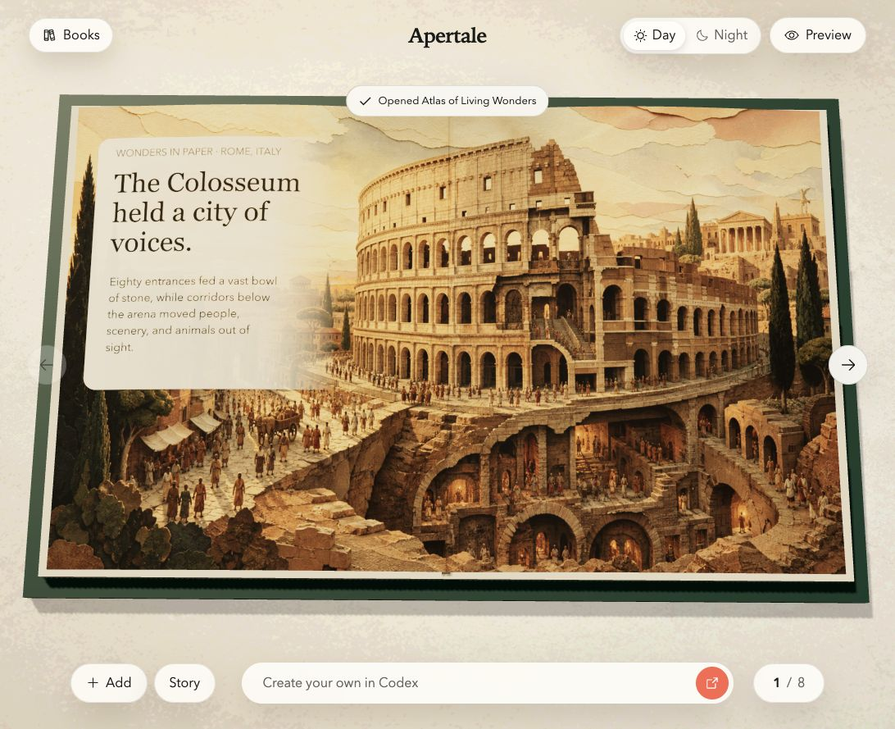
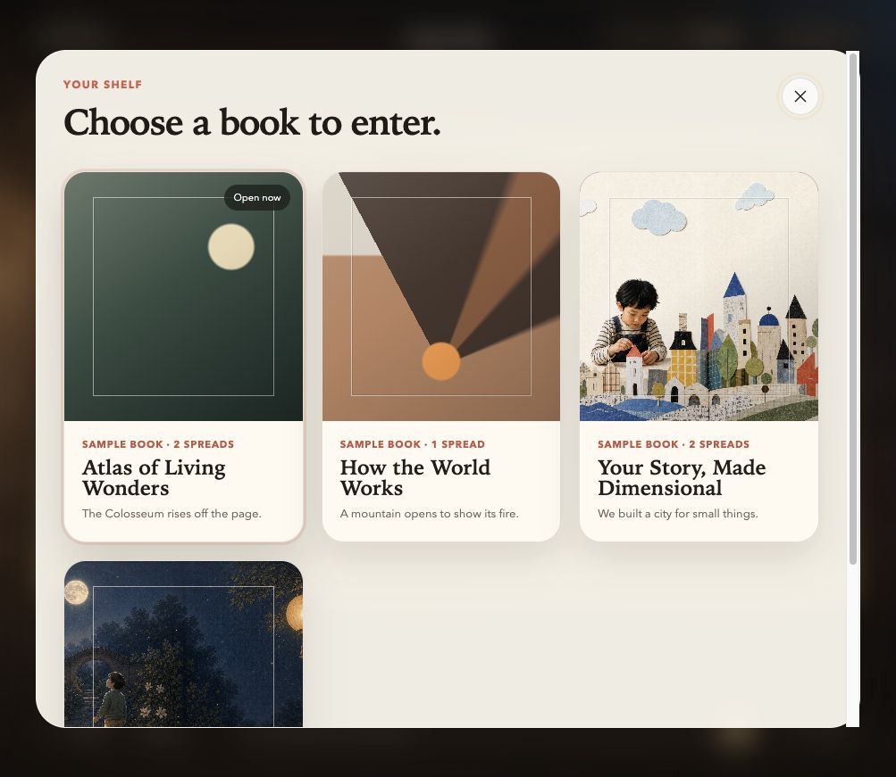
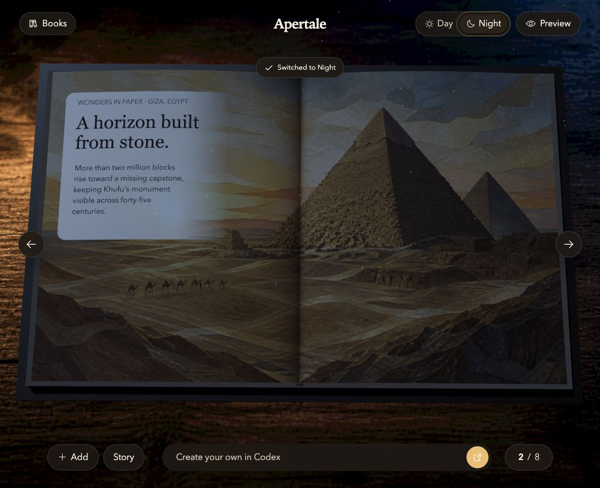

# Apertale

**Open a page. Enter a world.**

Apertale is a WebMCP-native canvas for interactive books. A person describes what they want in their own ChatGPT or Codex conversation; the host Agent uses Apertale's structured tools to compose, animate, and revise the same live book the person can turn, inspect, and edit directly.



The application provides the medium—Three.js book rendering, assets, safe interaction presets, project state, and exact undo. The user's ChatGPT session in a supporting host provides the intelligence and model usage. The project contains no shared owner-funded OpenAI API key and no fake in-page AI composer. Direct Codex-host WebMCP availability remains host-dependent and must be verified separately.

## Current build

- A tactile Three.js/WebGL book with deforming page geometry and a 2D/reduced-motion fallback.
- Day and Night presentation modes over one revisioned document.
- Shared human/WebMCP command engine with revision checks, idempotency, provenance, and exact undo tokens.
- WebMCP book creation, spread composition, structured knowledge reveals, and atomic bounded scene patches, plus focused inspection of selected reveals and local assets.
- Native local PNG/JPEG/WebP import backed by IndexedDB Blob storage; imported assets survive reload, remain reusable across books, and are accepted by the Agent only after a real local-store lookup.
- Declarative hover and click interactions validated against closed presets.
- A dimensional landmark knowledge spread as the first flagship sample.
- A real multi-book shelf: each Sample Book owns its own spreads, revisions, assets, and interactions.
- A host-portable Sites bundle. Public hosting remains intentionally private until explicit republish approval and final judge-facing verification.

## Try the collaboration loop

In a WebMCP-enabled ChatGPT desktop built-in browser, open Apertale and try:

> Inspect this Apertale project. Tell me which book, spread, and revision are open, then switch to Atlas of Living Wonders.

> Create a one-spread book about the geometry of eclipses. Add one lifted 3D focal object with a safe hover response, click fact card, and slow motion.

> Inspect my latest manual placement. Change only the object's motion, then undo your motion change without moving it back.

The first prompt proves page-grounded context and shelf navigation. The second proves structured authoring. The third proves that the Agent and the person share one revisioned artifact and that exact undo preserves later non-overlapping human work.

### Four independent books, two presentations

| Library | Night presentation |
|---|---|
|  |  |

## Run locally

```bash
cd app
npm install
npm run dev
```

## Verify

```bash
cd app
npm run typecheck
npm test
npm run build
npm run test:sites
npm run verify:deployment -- https://PUBLIC_APERTALE_URL/
```

## Repository map

- [`app/`](app/) — React, TypeScript, Three.js, WebMCP adapter, tests, and host-portable production bundle.
- [`docs/PRODUCT_ARCHITECTURE.md`](docs/PRODUCT_ARCHITECTURE.md) — active product, usage, asset, interaction, security, and delivery architecture.
- [`docs/CHALLENGE_READINESS.md`](docs/CHALLENGE_READINESS.md) — active challenge gate separating verified local work from missing external delivery.
- [`docs/ASSET_PROVENANCE.md`](docs/ASSET_PROVENANCE.md) — runtime art, procedural model, icon, reference, and user-import provenance.
- [`docs/SITE_TOOLS_ACCEPTANCE.md`](docs/SITE_TOOLS_ACCEPTANCE.md) — deployment verifier and real ChatGPT Site Tools acceptance story.
- [`docs/ELIGIBILITY_AND_BUILD_LOG.md`](docs/ELIGIBILITY_AND_BUILD_LOG.md) — challenge-period Git timeline and ownership evidence.
- [`docs/SUBMISSION_MEDIA.md`](docs/SUBMISSION_MEDIA.md) — source-true screenshots, captions, alt text, and demo-media usage.
- [`app/design-qa.md`](app/design-qa.md) — visual QA evidence and iteration history.
- [`docs/README.md`](docs/README.md) — current documentation and historical delivery evidence.

## Product boundary

The normal creation loop is bring-your-own-Agent:

1. Open Apertale in a supporting ChatGPT desktop built-in browser.
2. Import source assets into the live page when needed.
3. Ask ChatGPT to inspect and build the book.
4. ChatGPT invokes the page's WebMCP tools using the user's own account/session.
5. Continue editing together in one visible, undoable project.

Generated-image file transfer into a webpage is treated as an explicit import handoff until a direct host attachment bridge is verified. See the architecture document for the exact boundary.

License: [MIT](LICENSE).
