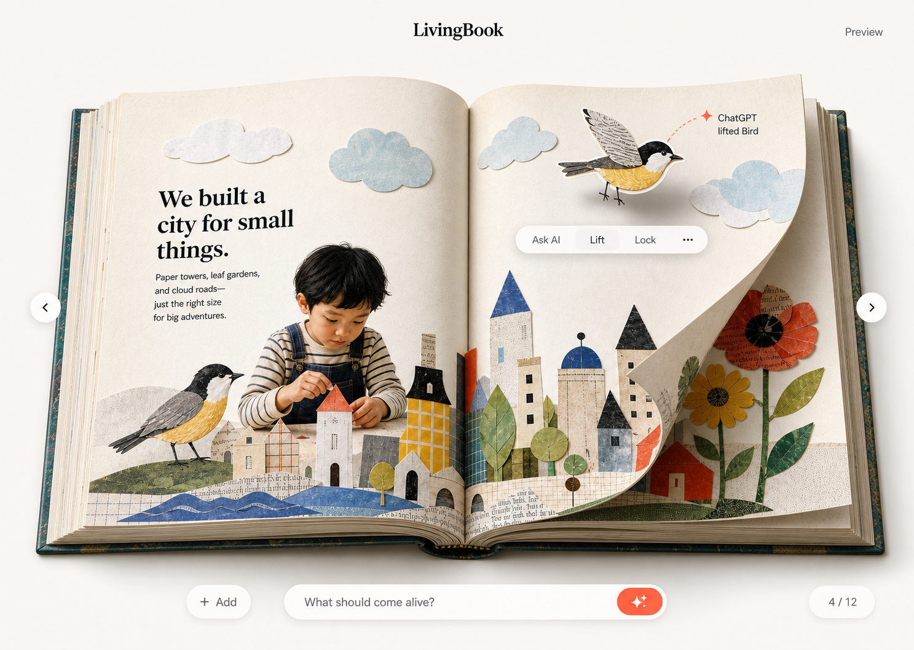
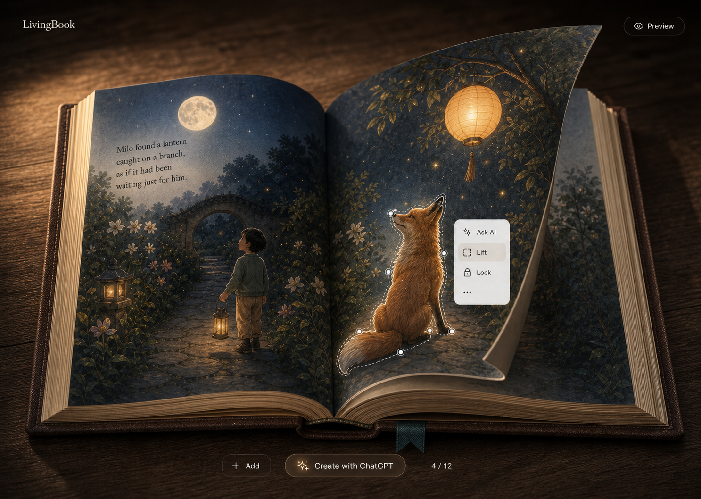
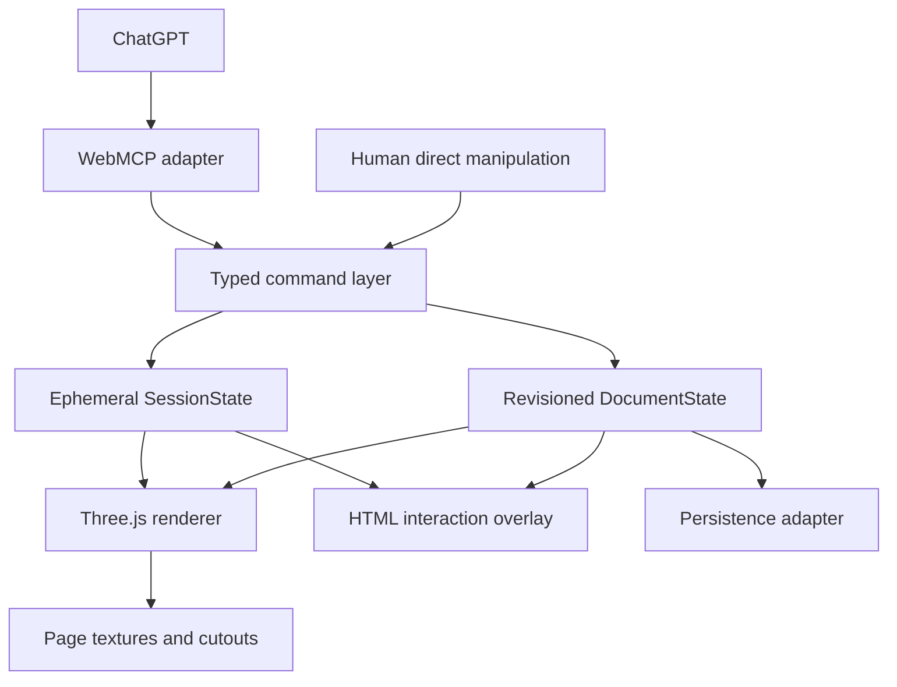

# LivingBook Studio — Archived WebMCP Challenge Specification

> Status: **Superseded historical specification — do not use as release truth**
> Version: **1.1**  
> Last updated: **2026-08-26 NZST**  
> Primary target: **OpenAI WebMCP Challenge**  
> Delivery: **one portable web app, published first as a ChatGPT Site**  
> Deadline: **2026-09-03 1:00 p.m. PT / 2026-09-04 8:00 a.m. NZST**

This document records the earlier LivingBook-branded build. It is retained only for traceability and no longer defines the product, tool names, acceptance gates, or submission state. The consolidated source of truth is [`PRODUCT_ARCHITECTURE.md`](PRODUCT_ARCHITECTURE.md), with current evidence in [`CHALLENGE_READINESS.md`](CHALLENGE_READINESS.md).

Reconciliation for Create Your Own: in-page owner-funded generation remains out of scope, but host-side prompt/photo-to-complete-book authoring in the user's Codex/ChatGPT conversation is now a required product path, not deferred work. Photo-led creation must analyze sources, plan a story, generate a dedicated cover and original full-spread art, and keep ordered provenance; placing uploaded source photos on the right page is not a finished book.

## 1. Product decision

LivingBook Studio is an AI-native interactive picture book where a person and ChatGPT work on the same live page.

The book is the interface. A person turns pages, selects and moves paper elements, and enters Preview directly. ChatGPT reads and changes the same structured book through WebMCP tools. The signature action, **Lift**, turns a prepared illustration element into an independent paper cutout that can be moved and animated above the page.

The Challenge thesis is:

> A picture book becomes meaningfully better when a person and an Agent can understand and manipulate the same live artifact together, without translating intent into editor panels or simulated clicks.

The submission is not a general AI design editor. It is one memorable, reliable collaboration loop:

1. A person selects the bird in a tactile 3D book.
2. ChatGPT inspects the current book through WebMCP.
3. ChatGPT lifts and animates the bird.
4. The person adjusts it directly and turns the page.
5. ChatGPT changes the scene to Night without changing the book content.
6. The person enters Preview and experiences the living story.

## 2. Why this product exists

Creative tools usually expose layers, masks, timelines, effects, and generation settings before a person can reach the result they imagined. AI tools reduce asset-production work but often place conversation beside the artifact instead of making the artifact directly operable.

LivingBook divides work according to each operator’s strengths:

- **Human:** spatial intent — select, drag, rotate, turn, preview.
- **Agent:** semantic intent — understand context, lift a named subject, apply meaningful motion, change atmosphere, undo a known change.
- **Application:** deterministic execution — validation, revisions, rendering, persistence, and visible feedback.

WebMCP is therefore part of the core product, not an integration added after the visual editor. ChatGPT receives a small semantic tool surface instead of guessing coordinates or operating a second hidden data model.

## 3. Challenge outcome

### 3.1 Submission goals

1. Demonstrate thoughtful WebMCP leverage through visible, semantic changes to a live artifact.
2. Make human–Agent collaboration understandable within the first 30 seconds of the demo.
3. Deliver a polished real-time book without allowing 3D ambition to compromise reliability.
4. Publish a working live URL, public source repository, clear setup instructions, visible open-source license, and a public demo video under three minutes.
5. Address the formal judging dimensions: WebMCP Leverage, Execution, Potential Impact, and Creativity & Ambition.

### 3.2 User outcome

A first-time visitor should be able to:

- understand that the open book is interactive without onboarding;
- turn a page and select a visible paper element;
- ask ChatGPT to change the selected element;
- see exactly what ChatGPT changed;
- adjust the Agent result directly;
- switch between Day and Night without changing story state;
- enter a distraction-free Preview.

### 3.3 Success metrics

- The published acceptance scenario completes without reload, hidden repair, paid model calls, or developer intervention.
- Human and Agent operations use one command system and remain mutually visible.
- The active page turn stays at or above 45 fps on the verified judging-browser test device; idle and direct manipulation target 60 fps.
- The app remains usable when WebMCP is unavailable and provides a 2D reduced-motion fallback when 3D is unavailable.
- All visible primary controls work; no fake AI composer or decorative non-functional editor controls remain.

## 4. Locked Challenge scope

### 4.1 Must ship

- One prepared sample book containing **three spreads**.
- A premium real-time 3D book with one active turning leaf and simplified static page stacks.
- Forward and backward page turns by button and drag gesture.
- One deterministic signature Lift path using prepared layered artwork.
- At least two prepared liftable elements across the sample book; the bird is the acceptance target.
- Selection, drag, scale, rotate, lock/unlock, and unified undo for structured elements.
- One named motion preset applied by ChatGPT to the lifted bird.
- Day and Night presentation presets applied to the same content state.
- Preview mode.
- Six WebMCP tools operating the same command and state layer as human actions.
- Visible, object-adjacent Agent action feedback.
- Local persistence sufficient to restore the committed sample state after reload.
- ChatGPT Site deployment plus a host-portable build path.
- Keyboard navigation, reduced motion, readable HTML outline, and a non-WebGL presentation fallback.

### 4.2 Explicitly deferred

The following belong to a future product and must not enter the Challenge critical path:

- arbitrary point- or region-based segmentation;
- automatic subject extraction from a flattened illustration;
- live image generation or regeneration **inside the webpage**, including any owner-funded OpenAI API key or in-page composer;
- in-page prompt-to-book or prompt-to-spread generation that bypasses the user's Codex/ChatGPT conversation;
- cloud asset management and cross-device photo libraries;
- PDF, print, video, or public-sharing export;
- a full layer panel, property inspector, animation timeline, or general design editor;
- twelve complete spreads as a Challenge-era sample requirement;
- multi-user collaboration, accounts, payments, or subscriptions;
- WebGPU-only rendering;
- SSAO, depth of field, multi-pass bloom, or other heavy post-processing;
- a second in-page ChatGPT or remote MCP server duplicating the host Agent.

Host-side authoring is **not** deferred. The required Create Your Own path is: the user supplies an idea, photos, or both in the current Codex/ChatGPT conversation; the Agent inspects sources, plans a coherent story, generates a dedicated portrait cover and original full-spread artwork for every spread, then lays the book out through the six Site Tools. Local Image handoff remains an explicit fallback, not cloud asset management.

### 4.3 Change-control rule

A new feature may enter version 1.1 only if it is required to pass the acceptance scenario or a submission gate. Otherwise it is recorded as post-Challenge work. Visual polish may continue only while the WebMCP and page-turn acceptance paths remain green.

## 5. Experience principles

### 5.1 Book first, UI second

The open book occupies approximately 80–90% of the primary desktop viewport. Controls are sparse, contextual, and hidden in Preview.

### 5.2 Direct manipulation for spatial intent

Selection, movement, scale, rotation, page turning, and locking belong to the person. These actions should feel immediate and require no Agent round trip.

### 5.3 Agent delegation for semantic intent

ChatGPT reads book context and performs named changes such as Lift, animate, theme, and undo. WebMCP tools expose product meaning, not button-level automation.

### 5.4 One artifact, two operators

Human actions and WebMCP calls dispatch commands into one revisioned document model. The renderer never owns business state, and there is no separate AI-result staging area.

### 5.5 Reversible and legible

Every document mutation is attributable and undoable. The affected object visibly reports the Agent action, for example `ChatGPT lifted Bird`.

### 5.6 Rendered, not overloaded

Paper shape, light, shadow, texture, depth, and motion create the premium feeling. Heavy full-screen effects do not substitute for material quality.

## 6. Visual system

### 6.1 Day — Paper Atelier



Purpose: creation, clarity, and tactile play.

- Bright cream studio or bookshop environment.
- Soft overcast key light and warm bounce.
- Paper cream, ink black, tomato coral, cornflower blue, butter yellow, and leaf green.
- Contemporary cut-paper, collage, and risograph textures.
- Coral is reserved for selection, Agent presence, and the primary action.
- Visible paper fibers, cover thickness, stacked page edges, center gutter, and soft contact shadow.

### 6.2 Night — Midnight Desk



Purpose: immersive preview and emotional demonstration.

- Dark walnut desk or quiet nighttime bookshop environment.
- Warm directional lamp plus cool moonlit fill.
- Deep graphite, midnight blue, walnut, moon silver, and amber.
- Emissive lantern details, glow sprites, sparse firefly particles, and deeper shadows.
- Dark translucent UI tokens with the same geometry and hierarchy as Day.

### 6.3 Reference-image interpretation

The reference images lock mood, material, lighting, composition density, and interaction character. They are not separate book states and do not require pixel-identical story content.

The sample book contains both the city/bird and fox/lantern motifs across its three spreads. During an actual theme switch, element IDs, page content, transforms, motion, and page order remain unchanged. Only the presentation preset interpolates.

### 6.4 Stable UI geometry

Across both themes:

- `LivingBook` is centered in the top bar.
- Theme and Preview controls are in the top-right area.
- Previous and next page controls sit outside the book edges.
- Page progress sits at the lower right.
- The lower center contains an Agent hint/status surface, not a second AI input.
- Contextual controls appear next to the selected element.

Theme switching must not move primary controls or recreate the book scene.

## 7. Primary interaction design

### 7.1 Default editor state

The user sees the open book, page navigation, a theme control, Preview, page progress, and a compact bottom hint such as:

> Try in ChatGPT: “Lift the bird and make it fly.”

The hint may copy a suggested prompt or explain the next action. It must not imply that the webpage contains a second conversational model.

### 7.2 Selection and direct editing

Clicking a structured element:

- draws a precise coral outline that is not color-only;
- shows sparse transform handles;
- anchors an HTML contextual menu to the projected 3D bounds;
- exposes `Ask ChatGPT`, `Lift`, `Lock/Unlock`, and `…` when relevant.

`Ask ChatGPT` establishes the active selection and displays a suggested prompt for use in the host ChatGPT conversation. It does not make a hidden model request.

During a page turn, the contextual menu fades and interaction handles freeze. They reproject only after the page settles.

### 7.3 Add

If the `Add` control is visible, it opens a small tray of prepared cut-paper assets and adds the chosen item as a structured element. In-page owner-funded generation and cloud-library behavior remain deferred. Host-side prompt/photo-to-complete-book authoring and the workshop's explicit Image handoff are required product paths, not this tray. If this tray is not complete, the `Add` control is omitted rather than shipped as a placeholder.

### 7.4 Deterministic Lift

Challenge Lift accepts an existing structured element only. Prepared page artwork has two representations:

1. a base page texture in which the liftable subject is omitted or visually covered;
2. a transparent cutout asset with stable element identity and original placement metadata.

Lift:

1. validates the target and expected document revision;
2. changes the element kind from embedded to lifted;
3. places the transparent cutout slightly above the page plane;
4. preserves apparent position, scale, and rotation;
5. enables shadow and motion behavior;
6. commits one revision and one undo token;
7. shows a short anchored Agent status.

Lift does not run segmentation, regeneration, or a paid external request in version 1.1.

### 7.5 Page turn

- Buttons provide deterministic forward/back navigation.
- A page-edge drag controls turn progress and may reverse before release.
- Only one leaf deforms at a time.
- Front and back content remain correct throughout the turn.
- The moving leaf casts and receives appropriate shadows.
- Reduced motion uses a short page slide/crossfade while preserving navigation semantics.

### 7.6 Theme switch

Day and Night are `ThemePreset` values over one scene. A 600–900 ms interpolation may change environment, background, key/fill/rim light, book material tuning, tone mapping, glow sprites, particles, and UI tokens.

The switch must not change document revision, content, selection identity, element transforms, motion, or undo history.

### 7.7 Preview

Preview hides editing chrome, settles the camera, enables approved ambient motion, and preserves the current spread and theme. Exit returns to the exact prior editing state.

## 8. Challenge demo story

The public video and live acceptance run use the same sequence:

1. Open the published app inside ChatGPT’s in-app browser in Day mode.
2. Turn to the city spread and select the bird manually.
3. Ask ChatGPT what it can change in the current book.
4. ChatGPT calls `get_book_context`.
5. Ask ChatGPT to lift the selected bird and make it fly.
6. ChatGPT calls `lift_element`, then `animate_element`.
7. The bird becomes an independent paper cutout and the page reports the Agent actions.
8. Drag the bird manually to a new position.
9. Ask ChatGPT to switch the scene to Night.
10. ChatGPT calls `set_scene_theme`; content remains unchanged.
11. Turn a page manually and enter Preview.
12. Ask ChatGPT to undo the bird animation and visibly restore the prior state.

This sequence intentionally gives spatial control to the person and semantic changes to ChatGPT. It demonstrates collaboration rather than an Agent performing every available action.

## 9. Technical architecture



### 9.1 Selected stack

- **Build:** Vite
- **Language:** TypeScript with strict checking
- **Application UI:** React
- **3D:** Three.js `WebGLRenderer` on a WebGL 2 baseline
- **State:** typed command core with a small external store; the command contract is framework-independent
- **Validation:** JSON Schema for WebMCP inputs and runtime validation at the adapter boundary
- **Unit tests:** Vitest for commands, revisions, idempotency, and undo
- **Browser checks:** automated smoke where practical plus required live acceptance in ChatGPT’s in-app browser

WebGPU is a future enhancement. Challenge code must not depend on WebGPU, TSL, or WebGPU-only post-processing.

### 9.2 Architectural invariants

1. The renderer observes committed state and never becomes the source of truth.
2. Human and Agent mutations use the same typed commands and history.
3. WebMCP code is isolated behind one adapter.
4. Document and session changes are distinct.
5. Every asynchronous tool supports cancellation and commits atomically.
6. The core human experience remains functional when WebMCP is absent.
7. Hosting-specific storage never leaks into the renderer or command model.

## 10. 3D book implementation

### 10.1 Rendering baseline

Use `THREE.WebGLRenderer` with correct color management and one quality-aware lighting setup. Do not begin with `WebGPURenderer`, a physics engine, or an EffectComposer chain.

The visual quality hierarchy is:

1. silhouette and proportions of the book;
2. readable high-resolution page art;
3. believable page curl;
4. contact and moving shadows;
5. paper material response;
6. restrained ambient glow and particles.

### 10.2 Book geometry

- Cover, spine, page block, and static stacks use simple optimized geometry.
- The active turning leaf is a procedural plane with approximately 40 width segments and a small number of height segments.
- CPU deformation updates the active leaf positions from deterministic turn progress.
- Normals and bounds are updated during the turn so lighting, shadows, raycasting, and projected UI anchors remain coherent.
- No general cloth or rigid-body simulation is used.

### 10.3 Front and back content

The turning leaf uses two Mesh instances sharing the same deformed geometry:

- the front Mesh uses `FrontSide` and the current-page texture;
- the back Mesh uses `BackSide` and the next-page texture.

This provides reliable distinct front/back artwork without requiring a custom PBR replacement shader. Page-edge thickness is suggested through the page stack, curl silhouette, and edge shading rather than a physically extruded sheet.

### 10.4 Page textures and lifted assets

- Challenge page art is prepared and bundled; editable structured metadata remains in state.
- Current and adjacent page textures are loaded; unused textures are disposed.
- A 2048 px page texture is the initial quality target and must be tuned against actual device memory and readability.
- Anisotropic filtering is enabled within device capability.
- Lifted assets are transparent planes with a subtle paper rim, small depth offset, and lightweight shadow behavior.
- HTML interaction controls are projected from 3D bounds and never baked into the page texture.

Canvas/OffscreenCanvas page composition is optional for the Challenge build. It may be used for structured text updates after the bundled texture path is stable; it is not a prerequisite for the demo.

### 10.5 Day/Night rendering

Required:

- one shadow-casting key light;
- inexpensive fill/rim lighting;
- baked or simple contact depth;
- tone mapping and theme-specific material tuning;
- emissive lantern or star details in Night;
- sparse glow sprites and particles that never cover text.

Optional only after performance acceptance:

- one restrained low-resolution bloom pass for Night.

Deferred:

- SSAO;
- depth of field;
- screen-space reflections;
- full-screen bloom;
- multiple shadow-casting lights.

### 10.6 Performance and fallback

Performance figures are product targets, not assumed platform guarantees:

- target 60 fps idle and manipulation;
- acceptance floor 45 fps during page turn on the verified test device;
- cap normal device pixel ratio around 1.5 and reduce to 1.0 when frame time requires it;
- use one active deforming leaf and dispose unused GPU resources;
- provide `balanced` and `reduced` quality modes;
- use the same page imagery in a DOM/2D presentation if WebGL initialization fails;
- respect `prefers-reduced-motion` for page turns, particles, and camera transitions.

The actual ChatGPT in-app browser GPU capability is a Day 0 runtime gate, not an assumption in this document.

## 11. Canonical state and command model

### 11.1 Persistent document state

```ts
type DocumentState = {
  id: string;
  revision: number;
  title: string;
  spreads: Spread[];
  assets: Record<string, Asset>;
};

type Spread = {
  id: string;
  order: number;
  leftPage: Page;
  rightPage: Page;
};

type Page = {
  id: string;
  backgroundAssetId: string;
  elements: Element[];
};

type Element = {
  id: string;
  label: string;
  kind: "embedded" | "lifted" | "text" | "decoration";
  assetId: string;
  transform: Transform2D;
  depth: number;
  locked: boolean;
  motion?: MotionSpec;
  provenance: "sample" | "human" | "agent";
};

type Transform2D = {
  x: number;
  y: number;
  scaleX: number;
  scaleY: number;
  rotationDeg: number;
};

type MotionSpec = {
  preset: "gentle-float" | "fly-across" | "soft-pulse";
  durationMs: number;
  loop: boolean;
};
```

Page-space coordinates are normalized from `0` to `1`, with origin at the upper-left of the logical page. Rendering converts them to the page mesh’s local coordinates.

### 11.2 Ephemeral session state

```ts
type SessionState = {
  currentSpreadId: string;
  selection: { elementId: string } | null;
  sceneThemeId: "paper-atelier" | "midnight-desk";
  preview: boolean;
  pageTurnProgress: number;
  quality: "balanced" | "reduced";
};
```

Navigation, selection, preview, theme, page-turn interpolation, and quality do not increment document revision. A theme preference may be stored separately without entering document history.

### 11.3 Command rules

- Document mutations require `requestId` and `expectedRevision`.
- A successful document mutation increments revision exactly once.
- Duplicate `requestId` values return the original result without reapplying the command.
- Revision conflicts do not partially mutate state.
- Human and Agent mutations enter the same document history.
- Undo targets an explicit `undoToken`; it never guesses from a global Agent-only stack.
- Undo applies the target command's inverse patch only to the fields that command changed. Non-overlapping later edits are preserved; if a later command changed the same field, undo returns an explicit conflict instead of overwriting it.
- Session commands are immediately reversible by human UI where appropriate but do not use document revision.

## 12. WebMCP contract

### 12.1 Tool surface

Only the following tools are registered for the Challenge build:

| Tool | State | Purpose |
|---|---|---|
| `get_book_context` | Read | Return a compact outline, current spread, active selection, theme, capabilities, and document revision. |
| `lift_element` | Document mutation | Lift one prepared structured element. |
| `edit_element` | Document mutation | Change transform, depth, or lock state for one element. |
| `animate_element` | Document mutation | Apply or remove one supported named motion preset. |
| `set_scene_theme` | Session mutation | Interpolate Day or Night without changing document content. |
| `undo_book_change` | Document mutation | Undo the exact reversible mutation represented by an undo token. |

Navigation and Preview remain human actions in version 1.1. This is intentional: the demo should show complementary operators rather than Agent control of every button.

### 12.2 Registration and lifecycle

- Register through `document.modelContext.registerTool` when available.
- Use action-oriented descriptions and closed JSON schemas.
- Mark `get_book_context` with `readOnlyHint: true`.
- Mark tools whose results may contain book text with `untrustedContentHint: true`.
- Pass a registration `AbortSignal` and unregister all tools when the book session unmounts.
- Forward the execution `AbortSignal` through asynchronous work and return without committing if canceled.
- If WebMCP is unavailable, expose a clear status while preserving the full human interaction path.

### 12.3 Input contracts

Document mutations extend:

```ts
type MutationEnvelope = {
  requestId: string;
  expectedRevision: number;
};
```

Challenge Lift does not accept page coordinates, arbitrary regions, image URLs, prompts, code, SQL, or filesystem paths. It accepts only a stable `elementId` discovered through `get_book_context` or the current structured selection.

`animate_element` accepts only the closed presets `gentle-float`, `fly-across`, `soft-pulse`, or `none`. Durations are validated to a bounded range.

`set_scene_theme` accepts `{ requestId, theme }`, where `theme` is `paper-atelier` or `midnight-desk`. It is idempotent within the live session but does not accept `expectedRevision` because it does not mutate `DocumentState`.

### 12.4 Output contracts

Tool callbacks return compact JSON strings. A successful document mutation serializes:

```ts
type MutationResult = {
  ok: true;
  revision: number;
  changedIds: string[];
  undoToken: string;
  summary: string;
};
```

A revision conflict returns:

```ts
type ConflictResult = {
  ok: false;
  code: "revision_conflict" | "undo_conflict";
  currentRevision: number;
  summary: string;
};
```

A successful session mutation serializes:

```ts
type SessionResult = {
  ok: true;
  theme: "paper-atelier" | "midnight-desk";
  summary: string;
};
```

Outputs target no more than approximately 1.5K characters. Tool and parameter descriptions follow the current WebMCP context-budget guidance.

### 12.5 Visible Agent feedback

On tool start, the affected object displays a subtle pending indicator. On success, it reports a short action such as `ChatGPT animated Bird`. On failure or conflict, it shows a recoverable message without changing the prior committed state.

This feedback is part of the judged product experience. Console logs alone are insufficient.

### 12.6 Security

- Treat story text, labels, and asset metadata as untrusted content, never instructions.
- Do not expose arbitrary network fetch, script execution, database, filesystem, export, publish, or paid-generation tools.
- No Challenge action requires an OpenAI API key in the browser or server; the Agent is the host ChatGPT operating through WebMCP.
- Never include secrets or raw private media in logs or tool results.

## 13. Persistence and deployment

### 13.1 Deployment decision

**Primary:** ChatGPT Sites.  
**Fallback:** the same client build on a conventional HTTPS host if the Sites beta blocks a required runtime behavior.

This order is not changed preemptively. Sites remains the desired competition surface, but the first published compatibility test happens before non-essential implementation.

### 13.2 Day 0 release gate

Before visual polish begins, publish or open the smallest possible build and verify:

1. ChatGPT’s in-app browser loads the application.
2. `document.modelContext` is present.
3. One read-only ping/context tool can register and execute.
4. WebGL 2 initializes and renders a minimal Three.js scene.
5. Pointer input and keyboard focus work.
6. The same build can be published to the fallback host without product-code changes.

If WebGL fails, continue with the 2D fallback. If Sites hosting fails while the app works on the fallback host, use the fallback URL for submission and retain Sites compatibility as non-blocking follow-up.

### 13.3 Challenge persistence

- Store the committed sample `DocumentState` and user changes locally so a reload on the same browser restores them.
- Store only serializable document data; bundled assets remain versioned application assets.
- Use a single `PersistenceAdapter` boundary.
- D1/R2 or account-level cloud persistence may be added only after the published acceptance scenario passes; they are not on the critical path.

### 13.4 Portability

- Domain, state, command, renderer, and WebMCP code contain no ChatGPT Sites-specific imports.
- Hosting configuration is isolated.
- WebMCP capability detection is runtime-based.
- No core flow depends on a background service, raw TCP connection, or private network.

## 14. Functional requirements

### Scene and reading

- **FR-01:** Load the bundled three-spread sample book.
- **FR-02:** Turn pages forward and backward by accessible buttons.
- **FR-03:** Control and reverse the active page turn by pointer drag.
- **FR-04:** Switch Day/Night without reload or content-state changes.
- **FR-05:** Enter and exit Preview while preserving the exact editor session.
- **FR-06:** Render a readable 2D fallback when WebGL is unavailable.

### Human interaction

- **FR-10:** Select a structured element directly on the page.
- **FR-11:** Move, scale, and rotate an unlocked element.
- **FR-12:** Lock and unlock an element.
- **FR-13:** Lift a prepared element through the contextual action.
- **FR-14:** Undo a human or Agent document mutation.
- **FR-15:** Keep projected controls stable, readable, and hidden during page deformation.

### Agent interaction

- **FR-20:** ChatGPT can inspect the current book, selection, capabilities, and revision.
- **FR-21:** ChatGPT can lift the selected prepared element.
- **FR-22:** ChatGPT can edit one structured element.
- **FR-23:** ChatGPT can apply or remove a supported motion preset.
- **FR-24:** ChatGPT can switch the presentation theme.
- **FR-25:** ChatGPT can undo an exact previous mutation.
- **FR-26:** Agent mutation results are both structurally returned and visibly reflected in the live page.
- **FR-27:** Tool cancellation, retries, conflicts, and failures never partially mutate the document.

### Persistence

- **FR-30:** Reload restores the latest committed document on the same browser.
- **FR-31:** Reset Sample restores the bundled Challenge state after explicit confirmation.

## 15. Non-functional requirements

### Accessibility

- All HTML controls are keyboard reachable and have accessible names.
- Page navigation never requires a drag gesture.
- Selection uses outline, handles, and labeling rather than color alone.
- UI text meets WCAG AA contrast.
- `prefers-reduced-motion` changes page turns, particles, and camera transitions.
- A readable HTML book outline exists outside the WebGL canvas.

### Reliability

- Failed or canceled commands leave the prior committed state intact.
- Reload never restores an in-progress page interpolation.
- Missing textures or GPU initialization produce a designed fallback, not a blank canvas.
- Page navigation, Lift, theme, and undo remain deterministic for the sample data.

### Observability

Record locally inspectable, non-sensitive events for:

- WebMCP registration and removal;
- tool start, success, cancellation, conflict, and failure;
- document revision and command source;
- WebGL initialization and selected quality tier;
- page-turn frame-time summary;
- fallback activation.

## 16. Verification strategy

### 16.1 Automated checks

Minimum command-layer coverage:

- one successful document mutation;
- stale revision rejection;
- duplicate request idempotency;
- undo restores the target mutation's fields while preserving non-overlapping later edits;
- undo rejects a same-field conflict instead of overwriting a later edit;
- session theme change does not increment document revision;
- human and Agent commands share one history;
- schema-invalid tool inputs are rejected before dispatch;
- cancellation before commit leaves state unchanged.

Minimum application gates:

- strict TypeScript check;
- production build;
- lint if configured;
- browser smoke for load, page navigation, selection, Lift, theme, Preview, and reload;
- no unexpected console errors during the acceptance path.

### 16.2 Visual checks

At the target desktop viewport, compare the implementation with both supplied reference images for:

- book scale and dominance;
- material and texture density;
- page readability;
- gutter, page-edge, and contact-shadow quality;
- contextual-menu placement;
- Day/Night hierarchy and mood;
- theme geometry consistency;
- page-turn front/back correctness.

### 16.3 Live checks

Automated browser success does not replace the final test. The complete scenario must pass against the published URL inside ChatGPT’s in-app browser using real WebMCP discovery and calls.

## 17. Challenge acceptance scenario

The build is accepted only when all steps pass in one session:

1. Open the published app and see the Day sample book.
2. Turn forward and backward using buttons and drag.
3. Select the bird manually and see accessible contextual controls.
4. Discover the six registered WebMCP tools.
5. Call `get_book_context` and receive the current spread, bird selection, capabilities, theme, and revision.
6. Call `lift_element` and see the bird become a separate paper cutout.
7. Receive a compact result containing the new revision and undo token.
8. Call `animate_element` with `fly-across` and see visible Agent attribution.
9. Drag the bird manually and confirm a later context read reports the updated transform and revision.
10. Call `set_scene_theme` and see Night interpolate without content or revision changes.
11. Turn a page and enter Preview manually.
12. Call `undo_book_change` for the animation; remove the motion while preserving the bird's later manual transform.
13. Reload and recover the latest committed document.
14. Repeat the core human flow with WebMCP unavailable.
15. Trigger or simulate no-WebGL/reduced-motion mode and confirm a readable fallback.

No step may depend on a paid generation call, hidden developer tool, manual state edit, or published-only code fork.

## 18. Delivery plan and stop conditions

### Day 0 — Compatibility gate

- Minimal Vite/TypeScript shell.
- Published ChatGPT Site probe.
- One WebMCP read tool.
- WebGL 2 triangle or minimal Three.js scene.
- Fallback-host proof.

**Stop condition:** the runtime/hosting decision is evidence-backed before 3D production begins.

### Day 1 — State and sample

- Locked schemas and sample book data.
- Command dispatcher, revision, idempotency, undo, persistence.
- Unit tests for command contracts.

**Stop condition:** human and simulated Agent commands demonstrably mutate one state.

### Day 2 — Book scene

- Camera, cover, spine, static stacks, page art, Day lighting.
- Readable viewport composition and 2D fallback shell.

**Stop condition:** the reference composition is recognizable and the book remains readable at target size.

### Day 3 — Page turn

- CPU-deformed active leaf.
- Distinct front/back content, shadows, drag/reverse, reduced motion.

**Stop condition:** page turn passes visual correctness and the 45 fps acceptance floor on the test device.

### Day 4 — Human interaction and Lift

- Selection, projected menu, transform, lock, prepared Lift, unified undo.
- Agent attribution UI states.

**Stop condition:** the bird can be selected, lifted, moved, and undone without WebMCP.

### Day 5 — WebMCP

- Six production schemas and registrations.
- Cancellation, conflicts, idempotency, compact results.
- Real ChatGPT context → Lift → animation flow.

**Stop condition:** the core Agent flow passes in the in-app browser against the published app.

### Day 6 — Night and quality

- Night preset, Preview, glow details, particles, quality reduction.
- Accessibility and failure states.

**Stop condition:** Night reaches the visual target without breaking the performance or reduced-motion gates.

### Day 7 — Submission lock

- Full live acceptance run.
- Public repository, license, README, setup instructions, and architecture summary.
- Under-three-minute public YouTube demo with audio.
- Devpost copy and final URL verification.

**Stop condition:** every submission artifact is public, opens anonymously, and matches the submitted source.

## 19. Risks and responses

| Risk | Decision |
|---|---|
| ChatGPT Sites beta blocks a required behavior | Run the Day 0 gate; use the same build on the fallback host if Sites fails. |
| WebMCP changes during the event | Isolate one adapter and recheck official docs before submission lock. |
| 3D polish causes stutter | Protect the 45 fps acceptance floor; reduce DPR, particles, shadow quality, then optional bloom. |
| Page-turn shader creates shadow/picking mismatch | Use CPU deformation for the one active leaf. |
| Front and back page content appear wrong | Use FrontSide/BackSide Meshes sharing the deformed geometry. |
| Lift extraction is unreliable | Ship prepared structured cutouts only; arbitrary segmentation is out of scope. |
| Human and Agent overwrite each other | Require revisions for document writes, idempotent request IDs, atomic commit, and explicit conflicts. |
| Agent UI appears fake or duplicated | Use the host ChatGPT; bottom and contextual surfaces only communicate selection, prompts, and status. |
| Sites storage work consumes the schedule | Use local committed-state persistence; D1/R2 is optional after acceptance. |
| Reference images imply different content across themes | Treat them as mood guides; verify theme parity on one unchanged spread. |
| Submission logistics are left too late | Day 7 includes anonymous URL, repo, license, README, and video verification as hard gates. |

## 20. Definition of done

LivingBook Studio Challenge Final 1.1 is done when:

- the published application passes all 15 acceptance steps in ChatGPT’s in-app browser;
- the same prepared bird is selectable, liftable, animatable, manually editable, and undoable;
- human and Agent operations use the same revisioned document and command history;
- Day and Night render the same content state with the intended visual character;
- the 3D page turn is visually correct and meets the measured performance floor;
- 2D and reduced-motion fallbacks remain readable and operable;
- the app contains no placeholder controls, hidden manual repair, paid generation dependency, or second AI backend;
- the live URL, public repository, visible open-source license, reproducible setup, project description, and public sub-three-minute video are complete;
- current official rules and API contracts are rechecked immediately before submission.

## 21. Post-Challenge product direction

These ideas remain valid but are not commitments for the in-page runtime:

- in-page owner-funded generation or a second embedded composer;
- arbitrary Lift from flat pages;
- cloud accounts and cross-device projects;
- export, sharing, and print;
- WebGPU/TSL rendering enhancements.

Host-side prompt-to-book and photo-to-complete-book authoring is no longer post-Challenge direction. It is a required product path: inspect sources, plan a story, generate cover and full-spread art in the user's conversation, then create the book through Site Tools. Local photo handoff is allowed as an explicit fallback; treating uploaded source photos as finished right-page artwork is not.

The remaining in-page items may begin only after the submitted build is frozen and reproducibly accepted.

## 22. Current official references

Checked on 2026-08-26:

- [OpenAI — WebMCP Challenge](https://openai.com/webmcp-challenge/)
- [Devpost — WebMCP Challenge rules and submission requirements](https://webmcp.devpost.com/)
- [OpenAI — ChatGPT Sites documentation](https://learn.chatgpt.com/docs/sites)
- [Chrome for Developers — WebMCP Imperative API](https://developer.chrome.com/docs/ai/webmcp/imperative-api)
- [Chrome for Developers — WebMCP tool security](https://developer.chrome.com/docs/ai/webmcp/secure-tools)
- [WebMCP specification](https://webmachinelearning.github.io/webmcp/)
- [Three.js — WebGPURenderer](https://threejs.org/manual/en/webgpurenderer)
- [Three.js — WebGLRenderer](https://threejs.org/docs/pages/WebGLRenderer.html)

## 23. Version 1.1 decisions

Accepted after independent Grok, Opus 5, GLM, and Codex review:

- WebGLRenderer/WebGL 2 is the Challenge baseline.
- CPU deformation is the active-page implementation.
- Lift is deterministic and structured, not segmentation-based.
- DocumentState and SessionState are separate.
- Six semantic WebMCP tools replace the broader version 0.1 surface.
- Human navigation and Preview remain human actions.
- The host ChatGPT is the only Agent; the page contains no second AI composer.
- ChatGPT Sites remains primary behind a Day 0 compatibility gate.
- Local persistence is sufficient for the Challenge critical path.
- Day and Night are presentation presets over identical book content.
- The official deadline is 1:00 p.m. PT, and public repository, license, live URL, and sub-three-minute public video are hard submission gates.
