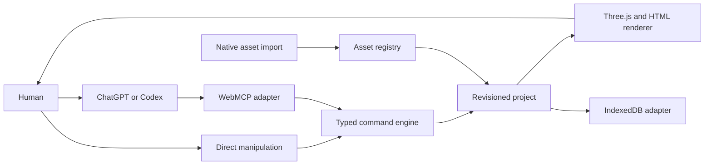

# Apertale — Challenge Final 1.1

> Status: active product and Challenge source of truth
>
> Version: 1.1 consolidated
>
> Checked: 2026-08-26 NZST
> Working brand: **Apertale — Open a page. Enter a world.**

This document consolidates the user-approved Challenge build and later multi-book scope. Earlier LivingBook-branded documents remain historical delivery evidence and do not override this specification.

## 1. Product

Apertale is a WebMCP-native canvas for creating and experiencing interactive books. The user describes a book in their own ChatGPT or Codex conversation. The host Agent reads the live project, composes spreads, assigns safe interactions, and edits the same artifact the user sees.

The website supplies the medium:

- a tactile Three.js book and 2D fallback;
- a structured document, asset registry, renderer, and exact undo;
- deterministic WebMCP tools;
- direct human manipulation, preview, and local import surfaces.

The user's ChatGPT/Codex supplies the intelligence. Apertale does not proxy every visitor through an owner-funded OpenAI API key and does not contain a second fake chat composer.

### Implementation snapshot

Implemented in the current local build: the 3D/2D book renderer, a persistent multi-book shelf, Colosseum, Great Pyramid, and volcano dioramas, closed interaction presets, revisioned commands, conflict-safe undo including book creation and shelf membership, Day/Night, the six-tool project surface, and IndexedDB-backed local image import whose stable IDs are discoverable and editable through WebMCP.

Required external delivery still open: a real supporting-host acceptance run and the explicitly approved public repository, live URL, video, and Devpost submission. Direct host attachment transfer and additional flagship 3D books remain post-v1.1 expansion work rather than hidden release dependencies.

## 2. Feasibility decision

### Verified now

- ChatGPT site tools use WebMCP and operate the current page and its signed-in browser session.
- A supporting ChatGPT account/model can discover and call tools exposed by the webpage.
- Site-tool activity remains visible in the conversation and sensitive actions require confirmation.
- Therefore the normal authoring loop runs through the visitor's eligible ChatGPT Work/Codex session while the page performs deterministic local edits. No owner API key is required; exact availability and usage remain governed by that visitor's ChatGPT account, selected model, plan, and workspace settings.
- The human UI can remain fully usable when WebMCP is absent.

Primary current references:

- [Using site tools in the ChatGPT desktop app](https://help.openai.com/en/articles/20001423-using-site-tools-in-the-chatgpt-desktop-app)
- [OpenAI WebMCP Challenge](https://openai.com/webmcp-challenge/)
- [WebMCP specification](https://github.com/webmachinelearning/webmcp)

The checked-in deployment verifier proves the public HTTP artifact, WebMCP document policy, manifest, and exact shipped tool identifiers. It deliberately cannot pass the host-only gate: real discovery and execution must follow [`SITE_TOOLS_ACCEPTANCE.md`](SITE_TOOLS_ACCEPTANCE.md) in an eligible ChatGPT desktop built-in browser.

### Host contract still to verify

Plain WebMCP tool arguments are structured JSON. A reliable direct contract for transferring a newly generated ImageGen file from the host conversation into an arbitrary webpage is not yet assumed.

Version 1 therefore uses an explicit asset handoff:

1. The user chooses or downloads a source image.
2. The user imports it with the native page file picker.
3. Apertale stores the Blob locally and returns a stable `assetId`.
4. The Agent reads asset metadata and composes the book using that ID.

If a supported host later exposes a verified attachment/file bridge, it can implement the same `AssetAdapter` without changing the book schema or renderer.

## 3. Core experience

1. The user opens Apertale in ChatGPT's built-in browser.
2. The page reports that its site tools are available.
3. In the real ChatGPT input, the user asks for a book, for example: “Use my travel photos to build a moonlit pop-up atlas. Give every landmark a different hover and click interaction.”
4. ChatGPT inspects project and asset context.
5. The Agent creates or patches the book through WebMCP.
6. Each committed step appears immediately in the same page, identifies its source, and is undoable.
7. The user turns pages, hovers, clicks, drags, adjusts, switches Day/Night, and previews directly.
8. The Agent can continue editing from the resulting live state.

The bottom page surface is a host hint/status strip. It may copy a suggested prompt or explain tool availability; it never pretends to send a model request itself.

## 4. Architecture



Architectural rules:

- Project state is authoritative; Three.js objects are render adapters.
- Human and Agent actions share one command/history layer.
- Every mutating tool validates schema, expected revision, visible scope, and stable IDs.
- Agent-authored content is data, never executable code.
- Theme, selection, camera hover, and preview state remain separate from document revisions where appropriate.
- Rendering, persistence, host integration, and asset storage are replaceable adapters.

## 5. Project model

```ts
interface Library {
  activeBookId: string;
  books: Record<string, Project>;
  localAssets: IndexedDbAssetIndex;
}

interface Project {
  id: string;
  title: string;
  revision: number;
  book: BookSpec;
  history: ChangeRecord[];
}

interface SpreadSpec {
  id: string;
  title: string;
  sceneType: "collage-2d" | "pop-up-3d" | "knowledge-diorama" | "landmark-atlas";
  narrative: NarrativeBlock[];
  elements: SceneElement[];
  camera: CameraPreset;
}

interface SceneElement {
  id: string;
  assetId?: string;
  kind: "image" | "cutout" | "model" | "text" | "light" | "particle" | "procedural";
  transform: Transform;
  material?: MaterialPreset;
  motion?: MotionPreset;
  interaction?: InteractionSpec;
  facts?: FactCard[];
}
```

## 6. Declarative interaction system

The Agent decides how a sample behaves at authoring time by writing an `InteractionSpec`. Runtime behavior is restricted to reviewed presets.

```ts
interface InteractionSpec {
  hover?: {
    effect: "lift" | "glow" | "tilt" | "pulse" | "orbit-preview" | "label";
    intensity?: "subtle" | "medium" | "bold";
    label?: string;
  };
  click?:
    | { action: "focus-camera"; cameraPreset: string }
    | { action: "play-motion"; motion: MotionPreset }
    | { action: "reveal-fact"; factId: string }
    | { action: "toggle-exploded-view"; groupId: string }
    | { action: "advance-sequence"; sequenceId: string };
  cursor?: "inspect" | "move" | "open";
  accessibleLabel: string;
}
```

Security boundary:

- no arbitrary JavaScript, GLSL, HTML, shader source, model URL, or event expression;
- no tool may fetch an arbitrary URL supplied by the model;
- imported binary assets are type/size validated and resolved through stable local IDs;
- unknown presets fail closed with a visible, undoable error state;
- reduced-motion maps each animated preset to a semantic static alternative.

## 7. WebMCP surface

Keep tools semantic and small enough for an Agent to select reliably. The target surface is:

1. `get_project_context` — current book, shelf, spread, selection, assets, capabilities, and revision.
2. `manage_book` — open an existing shelf book or create a validated independent book.
3. `compose_spread` — replace bounded spread text while preserving its structured scene.
4. `apply_scene_patch` — Lift, animate, add, update, remove, or reorder a bounded list of scene elements and interactions.
5. `set_presentation` — Day/Night and Preview state without corrupting content history.
6. `undo_project_change` — undo an exact returned token while preserving non-overlapping later edits.

`get_project_context` is compact by default. `detail: "selected-reveal"` returns the selected element's complete structured knowledge card; `detail: "assets"` lists up to 24 reusable local imports from the browser-wide IndexedDB asset directory. Fine-grained commands remain internal engine adapters for the human UI and do not register as Agent-discoverable tools.

Every mutation accepts `requestId` and `expectedRevision`, commits atomically, returns a compact summary plus `undoToken`, and preserves idempotency.

The runtime exposes exactly these six tools. The scene patch applies up to 24 operations atomically, provides field-aware composite undo, and rejects arbitrary URLs or executable content. Fine-grained element commands remain internal adapters shared with the human UI; they do not consume host tool-discovery budget.

## 8. Asset pipeline

### Implemented local pipeline

- Native import for PNG, JPEG, and WebP up to 1.5 MB.
- Blob storage and metadata in a browser-wide IndexedDB directory; stable IDs may be referenced from any local book.
- Alpha images become cutouts; flat photos remain image layers until a derived asset is imported.
- The Agent can discover reusable local assets, then arrange, light, animate, and attach interactions. A scene patch accepts an `asset:` ID only after the trusted storage adapter proves it exists.

### Planned asset expansion

- reviewed GLB/glTF import limits and validation;
- export that serializes the project manifest and referenced assets without leaking browser object URLs.

### Host-assisted generation

The user may ask ChatGPT/Codex to create images or derived assets using their own supported model capabilities. Until direct attachment transfer is verified, Apertale presents a clear “Import generated asset” step and resumes Agent composition immediately after import.

### Later adapters

- verified host attachment bridge;
- user-scoped cloud workspace;
- server-assisted segmentation or texture baking chosen and paid for by that user;
- collaborative project storage.

None may silently fall back to the product owner's model key.

## 9. Showcase books

### Atlas of Living Wonders

The flagship sample is a museum-like pop-up atlas. Each spread raises a world landmark from the center gutter with authored light, camera, facts, hover, and click behavior. The first production spread is the Colosseum; later spreads can cover Petra, Machu Picchu, the Taj Mahal, the Great Wall, Chichén Itzá, Christ the Redeemer, and a curated eighth site clearly labeled as an editorial choice rather than an official canon.

Example interactions:

- hover lifts the landmark and reveals its construction era;
- click focuses the camera and opens an exploded architectural section;
- a second click advances a construction timeline;
- Day/Night changes presentation while facts and project history stay fixed.

### How the World Works

An interactive science book where each spread unfolds into a dimensional system: volcano, cell, solar system, engine, ocean current, or anatomy. Click toggles exploded view or advances a causal sequence; hover identifies components and relationships.

### Your Story, Made Dimensional

A personal-photo sample demonstrates the real user workflow: imported photo assets, cutout/scene composition, unique interactions, and an Agent-authored narrative. It is not a pre-rendered fake generation flow.

## 10. Visual and motion direction

- The physical book is the hero and occupies most of the viewport.
- Day is a luminous paper atelier; Night is a cinematic walnut desk.
- Use material depth, real contact shadows, page fibers, restrained particles, and camera choreography before post-processing.
- Ship GLB/glTF 2.0 for reusable authored models. Keep procedural geometry for purposeful diagrams and verified fallbacks.
- Use standard materials and lighting first. Add shaders only for a measured visual need with fallback, reduced-motion, and context-loss behavior.
- DOM overlays carry readable controls, facts, keyboard focus, and accessibility semantics.
- Hover feedback begins within 100 ms; click acknowledgment within one frame; camera transitions remain cancelable.

Motion principles:

- A turning leaf remains one continuous, non-self-intersecting surface from gutter to outer edge; it never tears, swaps triangle order, or flashes the wrong face.
- Page navigation explains direction and settles before accepting the next arrow command; pointer-driven turns may reverse or cancel from their current progress.
- The book remains the spatial landmark. Shelf and fact surfaces enter above it without remounting or fading the entire world.
- Reduced motion removes depth travel and sustained spin while preserving selection, page position, and success/error feedback.

## 11. Persistence and privacy

- Challenge/demo build: IndexedDB, local-first, no account required.
- Imported assets remain in the user's browser unless they explicitly export or later connect storage.
- The project reports whether it is local-only, exported, or cloud-backed.
- No analytics event contains prompt text, book prose, private photo data, or binary content.
- Reset/delete targets one explicit project and offers a recoverable export first.

## 12. Repository and release policy

- Customer-facing names, UI, README, screenshots, and sample copy use Apertale, not internal event language.
- Historical event docs are retained as archive evidence and excluded from the primary navigation.
- The repository remains local/private until README, license, asset provenance, secret scan, visual QA, and WebMCP host acceptance are complete.
- Publishing the website or creating a public GitHub repository requires explicit user approval.
- A release must never embed an OpenAI API key.

## 13. Acceptance gates

### Product

- A first-time user understands that prompts belong in ChatGPT/Codex, not the webpage.
- The user can import an asset, ask the Agent to create a spread, and see a visible committed result.
- Human edits and Agent edits remain coherent and exactly undoable.
- Every primary sample has meaningful hover and click behavior.

### Technical

- Typecheck, unit tests, production build, and Sites bundle checks pass.
- WebMCP tools register and execute in the supported ChatGPT in-app browser.
- No owner API key, arbitrary model-authored code, or arbitrary URL fetch exists.
- WebGL context loss, 2D fallback, reduced motion, keyboard navigation, and mobile layout are verified.
- Interactive frame rate stays at or above 45 fps on the acceptance device; idle targets 60 fps.

### Visual

- The flagship landmark spread reads as a premium dimensional book, not a low-poly tech demo.
- Page turn, hover, click, camera, Day/Night, and Preview are visually reviewed at desktop and mobile viewports.
- All controls are real, readable, and user-friendly; no decorative dead controls remain.

### Release

- Current brand conflict check repeated before publication.
- Asset licenses/provenance documented.
- Repository contains no secrets and has a clean reproducible build.
- Anonymous production smoke occurs only after the user approves republishing.

## 14. Delivery order

1. Lock the project schema and declarative interaction engine.
2. Deliver one polished Colosseum knowledge-diorama end to end.
3. Keep each Sample Book as an independent project in the persistent shelf.
4. Replace legacy Agent tools with the compact project-authoring surface while preserving compatibility.
5. Build the remaining flagship Sample Books from real assets.
6. Complete visual, performance, accessibility, WebMCP host, and security acceptance.
7. Organize the public repository package.
8. Re-run naming clearance and publish only with explicit approval.
