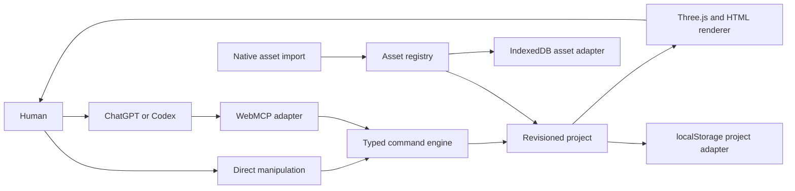

# Apertale — Challenge Final 1.1

> Status: active product and Challenge source of truth
>
> Version: 1.1 consolidated
>
> Checked: 2026-08-28 NZST
> Working brand: **Apertale — Open a page. Enter a world.**

This document consolidates the user-approved Challenge build and later multi-book scope. Earlier LivingBook-branded documents remain historical delivery evidence and do not override this specification.

Create Your Own is a required host-side product path: the user's Codex/ChatGPT conversation turns a prompt, photos, or both into a complete book through the six Site Tools. In-page owner-funded generation remains out of scope. Apertale never proxies visitors through a site-owner API key and never treats uploaded source photos as finished right-page artwork unless the user explicitly chose a literal photo-album treatment.

## 1. Product

Apertale is a WebMCP-native canvas for creating and experiencing interactive books. The user describes a book in their own ChatGPT or Codex conversation. The host Agent reads the live project, composes spreads, assigns safe interactions, and edits the same artifact the user sees.

The website supplies the medium:

- a tactile Three.js book and 2D fallback;
- a structured document, asset registry, renderer, and exact undo;
- deterministic WebMCP tools;
- direct human manipulation, preview, and local import surfaces.

The user's ChatGPT/Codex supplies the intelligence. Apertale does not proxy every visitor through an owner-funded OpenAI API key and does not contain a second fake chat composer.

### Implementation snapshot

Implemented in the current local build: a first-run editorial library of five independently generated hardcovers; an in-product Field Guide; five independent books with 28 spreads; the repaired watertight Three.js page turn with frozen composition sampling for illustrated layers; fourteen dedicated ImageGen panorama spreads; transparent cut-paper subjects and short frame animation; closed interaction presets; revisioned commands; conflict-safe undo including book creation, cover assignment, and library membership; distinct Day/Night presentation; the six-tool project surface; a repository-level Codex authoring skill; a typed host-side creation-brief contract that requires story planning and generated art before WebMCP layout; and IndexedDB-backed local image import whose stable IDs are discoverable and editable through WebMCP.

Required external delivery still open: a real supporting-host tool-execution acceptance run and the explicitly approved public repository, live URL, video, and Devpost submission. Direct host attachment transfer remains a post-v1.1 expansion rather than a hidden release dependency. The project stays private and local until the user approves release.

## 2. Feasibility decision

### Verified now

- ChatGPT site tools use WebMCP and operate the current page and its signed-in browser session.
- A supporting ChatGPT account/model can discover and call tools exposed by the webpage.
- Site-tool activity remains visible in the conversation and sensitive actions require confirmation.
- Therefore the normal authoring loop runs through the visitor's eligible ChatGPT Work/Codex session while the page performs deterministic local edits. No owner API key is required; exact availability and usage remain governed by that visitor's ChatGPT account, selected model, plan, and workspace settings.
- The human UI can remain fully usable when WebMCP is absent.

Primary current references:

- [Using site tools in the ChatGPT desktop app](https://help.openai.com/en/articles/20001423-using-site-tools-in-the-chatgpt-desktop-app)
- [OpenAI WebMCP Challenge](https://openai.com/webmcp-challenge/)
- [WebMCP specification](https://github.com/webmachinelearning/webmcp)

The checked-in deployment verifier proves the public HTTP artifact, WebMCP document policy, manifest, and exact shipped tool identifiers. It deliberately cannot pass the host-only gate: real discovery and execution must follow [`SITE_TOOLS_ACCEPTANCE.md`](SITE_TOOLS_ACCEPTANCE.md) in an eligible ChatGPT desktop built-in browser.

### Host contract still to verify

Plain WebMCP tool arguments are structured JSON. A reliable direct contract for transferring a newly generated ImageGen file from the host conversation into an arbitrary webpage is not yet assumed.

Version 1 therefore uses an explicit asset handoff:

1. The user chooses or downloads a source image.
2. The user imports it with the native page file picker.
3. Apertale stores the Blob locally and returns a stable `assetId`.
4. The Agent reads asset metadata and composes the book using that ID.

If a supported host later exposes a verified attachment/file bridge, it can implement the same `AssetAdapter` without changing the book schema or renderer.

## 3. Core experience

1. The user opens Apertale and lands on a clean editorial library, not furniture-like shelf geometry or an editor with a fake prompt box.
2. The Field Guide and **Create Your Own** action open a full-screen blank-book workshop that explains authoring happens in the conversation beside the built-in browser. The typed creation-brief contract accepts authoring mode (idea, photos, or both), exact spread count, visual direction, and ordered selected source assets so the starter prompt can force story planning and generated art before layout.
3. In that real Codex/ChatGPT input, the user asks for a book, for example: “Use my travel photos to build a moonlit pop-up atlas. Give every landmark a different hover and click interaction.”
4. The Agent follows a two-phase host-side contract in the current conversation: inspect sources and the user prompt; define audience or assumption and a complete story arc; plan title, dedicated generated cover, every spread, and ordered provenance; then use host ImageGen/image editing to make a portrait cover and purpose-built full-spread artwork for every spread. Source photos are references and story truth, not a lazy right-page placement unless the user explicitly chose a literal photo-album treatment.
5. Only after that asset plan and art set exist does the Agent create or patch the book through WebMCP, importing exact assets through supported transfer or the explicit Image handoff. It never claims generation or import succeeded without evidence.
6. Each committed step appears immediately in the same page, identifies its source, and is undoable.
7. The user turns pages, hovers, clicks, drags, adjusts, switches Day/Night, and previews directly.
8. The Agent can continue editing from the resulting live state.

The bottom page surface is an explicit **Create Your Own** action. It opens a full-screen blank-book workshop where the user chooses length and visual direction; a clearly labeled action copies the resulting starter prompt for the real Agent conversation. That prompt is a two-phase host-side contract: inspect and plan a story, generate a dedicated portrait cover plus original full-spread artwork for every spread, then—and only then—create the book through the six Site Tools. A secondary **Image handoff** accepts chosen images only when direct host media transfer is unavailable and exposes ordered local asset ids. No copy action is styled as an editable input and the webpage never pretends to send a model request itself.

## 4. Architecture



Architectural rules:

- Project state is authoritative; Three.js objects are render adapters.
- Human and Agent actions share one command/history layer.
- Every mutating tool validates schema, expected revision, visible scope, and stable IDs.
- Agent-authored content is data, never executable code.
- Theme, selection, camera hover, and preview state remain separate from document revisions where appropriate.
- Rendering, persistence, host integration, and asset storage are replaceable adapters.

## 5. Project model

```ts
interface Library {
  activeBookId: string;
  books: Record<string, Project>;
  localAssets: IndexedDbAssetIndex;
}

interface Project {
  id: string;
  title: string;
  revision: number;
  book: BookSpec;
  history: ChangeRecord[];
}

interface SpreadSpec {
  id: string;
  title: string;
  body: string;
  textureUrl?: string;
  artwork?: {
    sourceAssetId?: string;
    cleanPlateAssetId: string;
    separation: "inpainted-clean-plate";
  };
  elements: SceneElement[];
}

interface SceneElement {
  id: string;
  assetId: string;
  frameAssetIds?: string[];
  kind: "embedded" | "lifted" | "decoration";
  transform: Transform2D;
  motion?: MotionPreset;
  interaction?: InteractionSpec;
}
```

## 6. Declarative interaction system

The Agent decides how a sample behaves at authoring time by writing an `InteractionSpec`. Runtime behavior is restricted to reviewed presets.

```ts
interface InteractionSpec {
  hover: "none" | "lift-glow" | "tilt-toward-pointer" | "warm-rim";
  focus: "none" | "spotlight" | "rise-and-center" | "orbit-inspect";
  reveal: {
    kind: "none" | "caption" | "fact-card";
    title: string;
    summary: string;
    facts?: Array<{ label: string; value: string }>;
  };
  hint?: string;
}
```

Security boundary:

- no arbitrary JavaScript, GLSL, HTML, shader source, model URL, or event expression;
- no tool may fetch an arbitrary URL supplied by the model;
- imported binary assets are type/size validated and resolved through stable local IDs;
- unknown presets fail closed with a visible, undoable error state;
- reduced-motion maps each animated preset to a semantic static alternative.

## 7. WebMCP surface

Keep tools semantic and small enough for an Agent to select reliably. The target surface is:

1. `get_project_context` — current book, library, spread, selection, assets, capabilities, and revision.
2. `manage_book` — open a library book, create a validated independent book, or assign the active book a validated local cover.
3. `compose_spread` — replace bounded spread text while preserving its structured scene.
4. `apply_scene_patch` — Lift, animate, add, update, remove, or reorder a bounded list of scene elements and interactions.
5. `set_presentation` — Day/Night and Preview state without corrupting content history.
6. `undo_project_change` — undo an exact returned token while preserving non-overlapping later edits.

`get_project_context` is compact by default. `detail: "selected-reveal"` returns the selected element's complete structured knowledge card; `detail: "assets"` lists up to 24 reusable local imports from the browser-wide IndexedDB asset directory; `detail: "authoring-guide"` returns the site-native two-phase create-quality contract so a Site Tools conversation can author without an installed skill. The WebMCP registration session records that preflight and rejects `manage_book(action: "create")` until it has succeeded. Fine-grained commands remain internal engine adapters for the human UI and do not register as Agent-discoverable tools.

Every mutation accepts `requestId` and `expectedRevision`, commits atomically, returns a compact summary plus `undoToken`, and preserves idempotency.

The runtime exposes exactly these six tools. The scene patch applies up to 24 operations atomically, provides field-aware composite undo, and rejects arbitrary URLs or executable content. Fine-grained element commands remain internal adapters shared with the human UI; they do not consume host tool-discovery budget.

## 8. Asset pipeline

### Implemented local pipeline

- Native import for PNG, JPEG, and WebP source files up to 12 MB.
- Browser-local, alpha-aware resize/compression stores each import at no more than 1.5 MB and records original size, stored size, dimensions, and optimization status. Transparent sources remain PNG; opaque sources may become JPEG.
- Blob storage and metadata in a browser-wide IndexedDB directory; stable IDs may be referenced from any local book.
- Alpha images become cutouts; flat photos remain image layers until a derived asset is imported.
- The Agent can discover reusable local assets, then arrange, light, animate, and attach interactions. A scene patch accepts an `asset:` ID only after the trusted storage adapter proves it exists.
- Full-spread illustrations, transparent cutouts, and 2–6 frame sequences are generated or selected in the user's current Codex/ChatGPT conversation, then imported explicitly into browser-local storage.
- Uploaded source photos are references and story truth. They are not a finished right-page placement unless the user explicitly chose a literal photo-album treatment.
- The runtime ships no GLB/model payload and requires no external model-generation service or site-owner generation credential.

### Planned asset expansion

- direct host attachment handoff for generated images and frame sequences;
- export that serializes the project manifest and referenced assets without leaking browser object URLs.

### Host-side complete-book authoring

Host-side prompt/photo-to-complete-book authoring is a required product path, not a deferred extra. The user asks ChatGPT/Codex in the current conversation to inspect sources, plan a coherent story arc, and generate a dedicated portrait cover plus original full-spread artwork for every spread using their own supported model capabilities. Only after that art set exists does the Agent lay the book out through the six Site Tools. Until direct attachment transfer is verified, Apertale presents a clear Image handoff step and resumes Agent composition immediately after import. In-page owner-funded generation remains out of scope and must not silently fall back to the product owner's model key.

### Later adapters

- verified host attachment bridge;
- user-scoped cloud workspace;
- server-assisted segmentation or texture baking chosen and paid for by that user;
- collaborative project storage.

None may silently fall back to the product owner's model key.

## 9. Showcase books

### Atlas of Living Wonders

The flagship sample is an eight-spread museum-like pop-up atlas. Its independent book covers the Colosseum, Great Pyramid, Great Wall, Petra, Chichén Itzá, Machu Picchu, Taj Mahal, and Christ the Redeemer. Each spread has authored light, facts, hover, click, and a layered panoramic illustration inside the physical 3D book.

Example interactions:

- hover lifts an illustrated detail and reveals its construction era;
- click focuses the layer and opens a concise architectural fact card;
- a second click advances a construction timeline;
- Day/Night changes presentation while facts and project history stay fixed.

### How the World Works

An independent six-spread science book where each spread unfolds into an illustrated system: volcano, tectonic plates, water cycle, storm cell, ocean circulation, and solar system. The storm adds a three-frame lightning layer; hover and click open the structured explanation.

### Your Story, Made Alive

A personal-photo sample demonstrates the real user workflow: imported photo assets, cutout/scene composition, unique interactions, and an Agent-authored narrative. It is not a pre-rendered fake generation flow.

### The Apertale Field Guide

The default library puts a four-spread guide first. It explains text-to-book with ImageGen artwork, photo-led books that start in the Agent conversation and become planned illustrated stories rather than raw right-page photo dumps, living illustrated layers, and the distinction between curated samples and work generated in the user's live conversation.

## 10. Visual and motion direction

- The physical book is the hero and occupies most of the viewport.
- Day is a luminous paper atelier; Night is a cinematic walnut desk.
- Use material depth, real contact shadows, page fibers, restrained particles, and camera choreography before post-processing.
- Use full-spread PNG artwork and transparent image layers; reserve Three.js for the physical book, page turn, light, particles, and composition capture.
- Use standard materials and lighting first. Add shaders only for a measured visual need with fallback, reduced-motion, and context-loss behavior.
- DOM overlays carry readable controls, facts, keyboard focus, and accessibility semantics.
- Hover feedback begins within 100 ms; click acknowledgment within one frame; camera transitions remain cancelable.

Motion principles:

- A turning leaf remains one continuous, non-self-intersecting surface from gutter to outer edge; it never tears, swaps triangle order, or flashes the wrong face.
- Every open spread is first composed in an independent full-width scene with its background, lighting, and interactive illustrated subjects. One RenderTexture is UV-mapped across the two physical paper pages, so the composition may use the whole stage without belonging to either page mesh.
- Pointer hits first resolve against the physical paper, then map page UV into the shared stage camera for precise hover, click, and drag interaction.
- At turn start, the renderer freezes the fully composed outgoing/destination illustration and layers into dedicated render targets. The deforming leaf and backward base page sample those textures while the next live spread is revealed, preventing blank frames, disappearing layers, and page/content tearing.
- Page navigation explains direction and settles before accepting the next arrow command; pointer-driven turns may reverse or cancel from their current progress.
- The book remains the spatial landmark. Library and fact surfaces enter above it without remounting or fading the entire world.
- Reduced motion removes depth travel and sustained spin while preserving selection, page position, and success/error feedback.

## 11. Persistence and privacy

- Challenge/demo build: localStorage for project documents and IndexedDB for imported image blobs; local-first and no account required.
- Imported assets remain in the user's browser. Export and cloud-storage adapters are planned, not implemented.
- No analytics event contains prompt text, book prose, private photo data, or binary content.
- The current Reset action applies only to the active curated sample and requires confirmation. General project delete and recoverable export remain planned.

## 12. Repository and release policy

- Customer-facing names, UI, README, screenshots, and sample copy use Apertale, not internal event language.
- Historical event docs are retained as archive evidence and excluded from the primary navigation.
- The repository remains local/private until README, license, asset provenance, secret scan, visual QA, and WebMCP host acceptance are complete.
- Publishing the website or creating a public GitHub repository requires explicit user approval.
- A release must never embed an OpenAI API key.

## 13. Acceptance gates

### Product

- A first-time user understands that prompts belong in ChatGPT/Codex, not the webpage.
- Host-side Create Your Own can turn an idea, photos, or both into a complete book: planned story, generated cover, original full-spread art, ordered provenance, and honest media handoff.
- Photo-led creation is not accepted as placing uploaded source photos on the right page.
- The user can import an asset, ask the Agent to create a spread, and see a visible committed result.
- Human edits and Agent edits remain coherent and exactly undoable.
- Every primary sample has meaningful hover and click behavior.

### Technical

- Typecheck, unit tests, production build, and Sites bundle checks pass.
- WebMCP tools register and execute in the supported ChatGPT in-app browser.
- No owner API key, arbitrary model-authored code, or arbitrary URL fetch exists.
- WebGL context loss, 2D fallback, reduced motion, keyboard navigation, and mobile layout are verified.
- Interactive frame rate stays at or above 45 fps on the acceptance device; idle targets 60 fps.

### Visual

- The flagship landmark spread reads as a premium panoramic picture book, not a template with an asset placed on one side.
- Page turn, hover, click, camera, Day/Night, and Preview are visually reviewed at desktop and mobile viewports.
- All controls are real, readable, and user-friendly; no decorative dead controls remain.

### Release

- Current brand conflict check repeated before publication.
- Asset licenses/provenance documented.
- Repository contains no secrets and has a clean reproducible build.
- Anonymous production smoke occurs only after the user approves republishing.

## 14. Delivery order

1. Lock the project schema and declarative interaction engine.
2. Deliver one polished Colosseum knowledge-diorama end to end.
3. Keep each Sample Book as an independent project in the persistent library.
4. Replace legacy Agent tools with the compact project-authoring surface while preserving compatibility.
5. Build the remaining flagship Sample Books from real assets.
6. Complete visual, performance, accessibility, WebMCP host, and security acceptance.
7. Organize the public repository package.
8. Re-run naming clearance and publish only with explicit approval.
