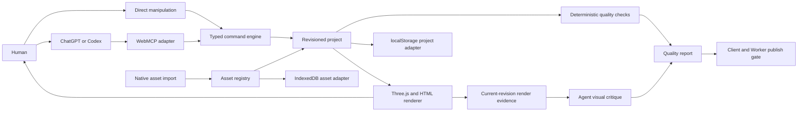

# Apertale — Challenge Final 1.1

> Status: active product and Challenge source of truth
>
> Version: 1.1 consolidated
>
> Checked: 2026-08-30 NZST
> Working brand: **Apertale — Open a page. Enter a world.**

This document consolidates the user-approved Challenge build and later multi-book scope. Earlier LivingBook-branded documents remain historical delivery evidence and do not override this specification.

Create Your Own is a required host-side product path: the user's Codex/ChatGPT conversation turns a prompt, photos, or both into a complete book through the eight Site Tools. In-page owner-funded generation remains out of scope. Apertale never proxies visitors through a site-owner API key and never treats uploaded source photos as finished right-page artwork unless the user explicitly chose a literal photo-album treatment.

## 1. Product

Apertale is a WebMCP-native canvas for creating and experiencing interactive books. The user describes a book in their own ChatGPT or Codex conversation. The host Agent reads the live project, composes spreads, assigns safe interactions, and edits the same artifact the user sees.

The website supplies the medium:

- a tactile Three.js book and 2D fallback;
- a structured document, asset registry, renderer, and exact undo;
- deterministic WebMCP tools;
- direct human manipulation, preview, and local import surfaces.

The user's ChatGPT/Codex supplies the intelligence. Apertale does not proxy every visitor through an owner-funded OpenAI API key and does not contain a second fake chat composer.

### Implementation snapshot

Implemented in the current build: a first-run editorial library of five independently generated hardcovers; an in-product Field Guide; five independent books with 28 spreads; the repaired watertight Three.js page turn with frozen composition sampling for illustrated layers; fourteen dedicated ImageGen panorama spreads; transparent cut-paper subjects and short frame animation; closed interaction presets; revisioned commands; conflict-safe undo including book creation, cover assignment, and library membership; distinct Day/Night presentation; the eight-tool project surface; a repository-level Codex authoring skill; a versioned creation-brief readiness gate shared by context and create; distinct illustrated-story, photo-led keepsake, and preserved-photo album contracts; IndexedDB-backed local image import; a versioned deterministic plus AI-visual quality rubric with current-render evidence and a two-round repair ceiling; fail-closed client/Worker publication; durable D1/R2 publication; and an anonymous read-only share reader.

The supporting-host tool run, public Site, and anonymous share lifecycle passed with the disclosures recorded in [`CHALLENGE_READINESS.md`](CHALLENGE_READINESS.md). External delivery still open is the explicitly approved public repository, demo video, and Devpost submission. Direct host attachment transfer remains a post-v1.1 expansion rather than a hidden release dependency.

## 2. Feasibility decision

### Verified now

- ChatGPT site tools use WebMCP and operate the current page and its signed-in browser session.
- A supporting ChatGPT account/model can discover and call tools exposed by the webpage.
- Site-tool activity remains visible in the conversation and sensitive actions require confirmation.
- Therefore the normal authoring loop runs through the visitor's eligible ChatGPT Work/Codex session while the page performs deterministic local edits. No owner API key is required; exact availability and usage remain governed by that visitor's ChatGPT account, selected model, plan, and workspace settings.
- The human UI can remain fully usable when WebMCP is absent.

Primary current references:

- [Using site tools in the ChatGPT desktop app](https://help.openai.com/en/articles/20001423-using-site-tools-in-the-chatgpt-desktop-app)
- [OpenAI WebMCP Challenge](https://openai.com/webmcp-challenge/)
- [WebMCP specification](https://github.com/webmachinelearning/webmcp)

The checked-in deployment verifier proves the public HTTP artifact, WebMCP document policy, manifest, and exact shipped tool identifiers. It deliberately cannot replace the host-only gate; that separate discovery/execution run has passed with the host disclosure recorded in [`SITE_TOOLS_ACCEPTANCE.md`](SITE_TOOLS_ACCEPTANCE.md) and [`CHALLENGE_READINESS.md`](CHALLENGE_READINESS.md).

### Host media contract still to verify

Plain WebMCP tool arguments are structured JSON. A reliable direct contract for transferring a newly generated ImageGen file from the host conversation into an arbitrary webpage is not yet assumed.

Version 1 therefore uses an explicit asset handoff:

1. The user chooses or downloads a source image.
2. The user imports it with the native page file picker.
3. Apertale stores the Blob locally and returns a stable `assetId`.
4. The Agent reads asset metadata and composes the book using that ID.

If a supported host later exposes a verified attachment/file bridge, it can implement the same `AssetAdapter` without changing the book schema or renderer.

## 3. Core experience

1. The user opens Apertale and lands on a clean editorial library, not furniture-like shelf geometry or an editor with a fake prompt box.
2. The Field Guide and **Create Your Own** action open a full-screen blank-book workshop that explains authoring happens in the conversation beside the built-in browser. The workshop captures only choices it can truthfully own and sends the user to the Agent for the premise, audience, source-photo treatment, and identity boundaries. It never promises a locally unreachable ready state.
3. In that real Codex/ChatGPT input, the user asks for a book, for example: “Use my travel photos to build a moonlit pop-up atlas. Give every landmark a different hover and click interaction.”
4. The Agent reads the versioned readiness contract. Blocking omissions return machine-readable fields plus short questions; meaningful defaults remain recommendations. Real source-asset existence, source use, and identity risk are checked even if the submitted book-type label says illustrated storybook.
5. A ready illustrated/photo-led brief plans one dedicated generated cover and one purpose-built full-spread illustration per spread. A ready preserved-photo album plans one generated cover and source-true 2:1 layouts with no generated interior, under explicit crop/colour/identity rules. The create command reruns the same readiness gate before mutation.
6. Only after the applicable asset plan exists does the Agent create or patch the book through WebMCP, importing exact assets through supported transfer or the explicit Image handoff. It never claims generation or import succeeded without evidence.
7. The Agent renders the shelf cover and every spread, reads deterministic findings and a render manifest, then inspects the actual frames for visual criteria. It records blocker/warn/note evidence, patches and re-checks at most twice, and stops for source material or a decision if blockers remain.
8. Share/Publish revalidates the current-revision report in the client and Worker. Warnings can proceed only when recorded in a sample-ready report; blockers fail closed. Existing public revisions and curated samples remain readable.
9. Each committed step appears immediately in the same page, identifies its source, and is undoable.
10. The user turns pages, hovers, clicks, drags, adjusts, switches Day/Night, and previews directly.
11. The Agent can continue editing from the resulting live state.

The bottom page surface is an explicit **Create Your Own** action. It opens a full-screen blank-book workshop where the user chooses authoring mode, length, visual direction, photo treatment, and ordered source images; a clearly labeled action copies the resulting starter prompt for the real Agent conversation. The workshop says **Finish the brief in Codex** because premise and audience are resolved by the Agent readiness loop. The prompt branches between generated illustrated interiors and approved source-true preserved layouts, then requires actual rendering and critique before publish. A secondary **Image handoff** accepts chosen images only when direct host media transfer is unavailable and exposes ordered local asset ids. No copy action is styled as an editable input and the webpage never pretends to send a model request itself.

## 4. Architecture



Architectural rules:

- Project state is authoritative; Three.js objects are render adapters.
- Human and Agent actions share one command/history layer.
- Every book or presentation mutation validates schema, the expected document id and revision from one context, visible scope, and stable IDs.
- Agent-authored content is data, never executable code.
- Theme, selection, camera hover, and preview state remain separate from document revisions where appropriate.
- Rendering, persistence, host integration, and asset storage are replaceable adapters.

## 5. Project model

```ts
interface Library {
  activeBookId: string;
  books: Record<string, Project>;
  localAssets: IndexedDbAssetIndex;
}

interface Project {
  id: string;
  title: string;
  revision: number;
  book: BookSpec;
  history: ChangeRecord[];
}

interface SpreadSpec {
  id: string;
  title: string;
  body: string;
  textureUrl?: string;
  artwork?: {
    /** Original full-spread composite reference. */
    sourceAssetId?: string;
    /** Declared user photo governed by identity/source-use policy. */
    personalSourceAssetId?: string;
    cleanPlateAssetId: string;
    separation: "inpainted-clean-plate" | "preserved-photo-layout";
  };
  elements: SceneElement[];
}

interface SceneElement {
  id: string;
  assetId: string;
  frameAssetIds?: string[];
  kind: "embedded" | "lifted" | "decoration";
  transform: Transform2D;
  motion?: MotionPreset;
  interaction?: InteractionSpec;
}
```

## 6. Declarative interaction system

The Agent decides how a sample behaves at authoring time by writing an `InteractionSpec`. Runtime behavior is restricted to reviewed presets.

```ts
interface InteractionSpec {
  hover: "none" | "lift-glow" | "tilt-toward-pointer" | "warm-rim";
  focus: "none" | "spotlight" | "rise-and-center" | "orbit-inspect";
  reveal: {
    kind: "none" | "caption" | "fact-card";
    title: string;
    summary: string;
    facts?: Array<{ label: string; value: string }>;
  };
  hint?: string;
}
```

Security boundary:

- no arbitrary JavaScript, GLSL, HTML, shader source, model URL, or event expression;
- no tool may fetch an arbitrary URL supplied by the model;
- imported binary assets are type/size validated and resolved through stable local IDs;
- unknown presets fail closed with a visible, undoable error state;
- reduced-motion maps each animated preset to a semantic static alternative.

## 7. WebMCP surface

Keep tools semantic and small enough for an Agent to select reliably. The target surface is:

1. `get_project_context` — current book, library, spread, selection, assets, capabilities, versioned readiness, quality rubric/render manifest, and revision.
2. `manage_book` — open a library book, create a readiness-validated independent book, adopt one readiness-passed brief for a legacy personal book, assign a validated local cover, explicitly begin critique, or record a structured critique.
3. `compose_spread` — replace bounded spread text while preserving its structured scene.
4. `apply_scene_patch` — Lift, animate, add, update, remove, or reorder a bounded list of scene elements and interactions.
5. `set_presentation` — Day/Night and Preview state, plus acknowledged shelf-cover or reader-spread presentation, without corrupting content history.
6. `undo_project_change` — undo an exact returned token while preserving non-overlapping later edits.
7. `sketch_storyboard` — draw the complete rough pencil storyboard on the blank 3D book before final art, then revise only the spreads the reader marked in red; it never changes the document revision.
8. `request_image_handoff` — open a focused import drawer with the Agent's reason and an explicit `source-photo` or `book-art` role, then resolve after the reader provides browser-local assets or dismisses the request.

`get_project_context` is compact by default. Focused details expose the selected reveal, reusable local assets, the authoring guide, `creation-readiness`, or `quality-review`. Readiness produces `ready`, blocking fields, recommendations, direct questions, asset needs, and photo boundaries. Create reuses the same brief and fails closed under the same assessment. A legacy personal book without lifecycle metadata can adopt that brief once at the inspected revision; curated samples and books with an existing brief cannot be reclassified. Quality review returns the single-source rubric, deterministic checks, current-revision render events, and locators/URL for real browser inspection; it does not pretend schema can judge aesthetics. Critique begins through an explicit mutating action and is recorded with evidence and suggested patches. A blocker/patch cycle stops after two rounds; an edit made after an approved report invalidates that report and starts a fresh bounded cycle for the new revision, so no action can advertise a round three. Fine-grained commands remain internal engine adapters for the human UI and do not register as Agent-discoverable tools.

Every mutation accepts `requestId`. Book and presentation mutations also accept `expectedDocumentId` and `expectedRevision` from the same context; document changes commit atomically, return a compact summary plus `undoToken`, and preserve idempotency. Image handoff changes no document revision and returns only provided asset ids or the reader's dismissal. A book-open/create result is reported only after the same live page has committed an unobstructed reader surface; presentation calls similarly acknowledge the requested shelf or reader state.

The runtime exposes exactly these eight tools. The scene patch applies up to 24 operations atomically, provides field-aware composite undo, and rejects arbitrary URLs or executable content. Fine-grained element commands remain internal adapters shared with the human UI; they do not consume host tool-discovery budget.

## 8. Asset pipeline

### Implemented local pipeline

- Native import for PNG, JPEG, and WebP source files up to 12 MB.
- Browser-local, alpha-aware resize/compression stores each import at no more than 1.5 MB and records original size, stored size, dimensions, and optimization status. Transparent sources remain PNG; opaque sources may become JPEG.
- Blob storage and metadata in a browser-wide IndexedDB directory; stable IDs may be referenced from any local book.
- Alpha images become cutouts; flat photos remain image layers until a derived asset is imported.
- The Agent can discover reusable local assets, then arrange, light, animate, and attach interactions. A scene patch accepts an `asset:` ID only after the trusted storage adapter proves it exists.
- Full-spread illustrations, transparent cutouts, and 2–6 frame sequences are generated or selected in the user's current Codex/ChatGPT conversation, then imported explicitly into browser-local storage. Preserved-photo albums instead keep an approved source-true final base per spread and add only restrained layers.
- Uploaded source photos are references and story truth for illustrated/photo-led books. They become preserved final layouts only after the user explicitly chooses that treatment and authorizes crop, colour, and identity boundaries.
- `sourceAssetId` always retains the original composite used to derive a spread; `personalSourceAssetId` separately retains declared photo provenance. Client mutation, deterministic review, publish client, and Worker validate the same distinction.
- Checked-in `/assets/...` references are admitted by a build-checked Worker catalog generated from `public/assets`; arbitrary but syntactically plausible paths fail closed.
- The runtime ships no GLB/model payload and requires no external model-generation service or site-owner generation credential.

### Planned asset expansion

- direct host attachment handoff for generated images and frame sequences;
- export that serializes the project manifest and referenced assets without leaking browser object URLs.

### Host-side complete-book authoring

Host-side prompt/photo-to-complete-book authoring is a required product path, not a deferred extra. The user asks ChatGPT/Codex in the current conversation to assess readiness, inspect sources, and plan a coherent story or album. Illustrated/photo-led work generates a dedicated portrait cover plus original full-spread artwork; an explicitly selected preserved-photo album keeps one source-true layout per spread and generates no interior replacement. Only after the applicable asset set exists does the Agent lay the book out through the eight Site Tools, render every surface, and complete the bounded critique loop. Until direct attachment transfer is verified, `request_image_handoff` opens the reader-mediated import step and resumes Agent composition after it returns browser-local asset ids. In-page owner-funded generation remains out of scope and must not silently fall back to the product owner's model key.

### Later adapters

- verified host attachment bridge;
- user-scoped cloud workspace;
- server-assisted segmentation or texture baking chosen and paid for by that user;
- collaborative project storage.

None may silently fall back to the product owner's model key.

## 9. Showcase books

### Atlas of Living Wonders

The flagship sample is an eight-spread museum-like pop-up atlas. Its independent book covers the Colosseum, Great Pyramid, Great Wall, Petra, Chichén Itzá, Machu Picchu, Taj Mahal, and Christ the Redeemer. Each spread has authored light, facts, hover, click, and a layered panoramic illustration inside the physical 3D book.

Example interactions:

- hover lifts an illustrated detail and reveals its construction era;
- click focuses the layer and opens a concise architectural fact card;
- a second click advances a construction timeline;
- Day/Night changes presentation while facts and project history stay fixed.

### How the World Works

An independent six-spread science book where each spread unfolds into an illustrated system: volcano, tectonic plates, water cycle, storm cell, ocean circulation, and solar system. The storm adds a three-frame lightning layer; hover and click open the structured explanation.

### Your Story, Made Alive

A personal-photo sample demonstrates the real user workflow: imported photo assets, cutout/scene composition, unique interactions, and an Agent-authored narrative. It is not a pre-rendered fake generation flow.

### The Apertale Field Guide

The default library puts a four-spread guide first. It explains text-to-book with ImageGen artwork, photo-led books that start in the Agent conversation and become planned illustrated stories rather than raw right-page photo dumps, living illustrated layers, and the distinction between curated samples and work generated in the user's live conversation.

## 10. Visual and motion direction

- The physical book is the hero and occupies most of the viewport.
- Day is a luminous paper atelier; Night is a cinematic walnut desk.
- Use material depth, real contact shadows, page fibers, restrained particles, and camera choreography before post-processing.
- Use full-spread PNG artwork and transparent image layers; reserve Three.js for the physical book, page turn, light, particles, and composition capture.
- Use standard materials and lighting first. Add shaders only for a measured visual need with fallback, reduced-motion, and context-loss behavior.
- DOM overlays carry readable controls, facts, keyboard focus, and accessibility semantics.
- Hover feedback begins within 100 ms; click acknowledgment within one frame; camera transitions remain cancelable.

Motion principles:

- A turning leaf remains one continuous, non-self-intersecting surface from gutter to outer edge; it never tears, swaps triangle order, or flashes the wrong face.
- Every open spread is first composed in an independent full-width scene with its background, lighting, and interactive illustrated subjects. One RenderTexture is UV-mapped across the two physical paper pages, so the composition may use the whole stage without belonging to either page mesh.
- Pointer hits first resolve against the physical paper, then map page UV into the shared stage camera for precise hover, click, and drag interaction.
- At turn start, the renderer freezes the fully composed outgoing/destination illustration and layers into dedicated render targets. The deforming leaf and backward base page sample those textures while the next live spread is revealed, preventing blank frames, disappearing layers, and page/content tearing.
- Page navigation explains direction and settles before accepting the next arrow command; pointer-driven turns may reverse or cancel from their current progress.
- The book remains the spatial landmark. Library and fact surfaces enter above it without remounting or fading the entire world.
- Reduced motion removes depth travel and sustained spin while preserving selection, page position, and success/error feedback.

## 11. Persistence and privacy

- Draft project documents use localStorage and imported image blobs use IndexedDB; drafting remains local-first and requires no account.
- Explicit publication writes the document manifest and hashed capabilities to D1 and uploads only its referenced image blobs to that book's R2 namespace.
- The browser creates and persists each draft id and 256-bit management capability before the first server write. A per-document Web Lock serializes publish, revoke, and delete across same-origin tabs before that identity is read or created. `POST /api/books` then idempotently registers the pair, so neither a cold concurrent call nor a lost create response can leave an unmanageable orphan draft.
- An interrupted publish reconciles the stored share capability before reading or uploading the current revision. D1 atomically claims one pending share-token hash; the same attempt can resume through response loss or a Worker restart, while competing tokens cannot overwrite it. If the server already committed, the client restores the server revision and URL. Every token retired by revoke or delete remains in a hash-only D1 ledger, so an older public URL cannot be resurrected by a later book or publication generation.
- Publish, revoke, republish, and permanent delete use capability-authenticated endpoints. Management and share tokens are unguessable, D1 stores only their SHA-256 hashes, and management capability never appears in the public URL.
- A share URL is anonymous read-only capability access, not end-to-end encryption or a private account boundary. Revocation makes the manifest, shell, and assets return 404 with private no-store caching.
- Permanent deletion first removes public reachability, then deletes every D1-indexed R2 object, then removes D1 state. Normal upload failures are compensated and request races are transactionally closed. One infrastructure boundary remains explicit: an arbitrary Worker termination after an R2 write succeeds but before its D1 insert can leave an unreferenced private object. Closing that gap requires an upload ledger plus a multipart visibility barrier; request-time prefix sweeps are not a finite deletion guarantee. The root-fix contract is tracked in [issue #23](https://github.com/mike007jd/apertale/issues/23).
- Capability-only publishing has no account recovery. Losing the local management capability loses management access. Anonymous creation has bounded site and time-window quotas; an append-only creation-event ledger outlives book deletion so delete/recreate loops cannot reset the rolling limit. The service still has no identity-based recovery or abuse policy.
- No analytics event contains prompt text, book prose, private photo data, or binary content.
- Recoverable project export remains planned.

## 12. Repository and release policy

- Customer-facing names, UI, README, screenshots, and sample copy use Apertale, not internal event language.
- Historical event docs are retained as archive evidence and excluded from the primary navigation.
- The public Site and anonymous share reader were live-verified on 2026-08-28; the source repository remains private.
- Republishing the website or making the GitHub repository public requires explicit user approval.
- A release must never embed an OpenAI API key.

## 13. Acceptance gates

### Product

- A first-time user understands that prompts belong in ChatGPT/Codex, not the webpage.
- Host-side Create Your Own can turn an idea, photos, or both into a complete book: planned story, generated cover, original full-spread art, ordered provenance, and honest media handoff.
- Photo-led creation is not accepted as placing uploaded source photos on the right page.
- The user can import an asset, ask the Agent to create a spread, and see a visible committed result.
- Human edits and Agent edits remain coherent and exactly undoable.
- Every primary sample has meaningful hover and click behavior.

### Technical

- Typecheck, unit tests, production build, and Sites bundle checks pass.
- WebMCP tools register and execute in the supported ChatGPT in-app browser.
- No owner API key, arbitrary model-authored code, or arbitrary URL fetch exists.
- WebGL context loss, 2D fallback, reduced motion, keyboard navigation, and mobile layout are verified.
- Interactive frame rate stays at or above 45 fps on the acceptance device; idle targets 60 fps.

### Visual

- The flagship landmark spread reads as a premium panoramic picture book, not a template with an asset placed on one side.
- Page turn, hover, click, camera, Day/Night, and Preview are visually reviewed at desktop and mobile viewports.
- All controls are real, readable, and user-friendly; no decorative dead controls remain.

### Release

- Current brand conflict check repeated before publication.
- Asset licenses/provenance documented.
- Repository contains no secrets and has a clean reproducible build.
- The current public version has passed anonymous production smoke; repeat that smoke after any explicitly approved republish.

## 14. Remaining delivery work

1. Run the independent pre-recording live verification against the intended production version.
2. Record and publish the source-true demo video only after that verification passes.
3. Make the repository public only with explicit approval, preserving history, license, provenance, and reproducible gates.
4. Complete the Devpost fields and anonymous judge-view check before submission.
5. Treat direct host attachment transfer and account-backed recovery as later adapters, not hidden v1.1 dependencies.
